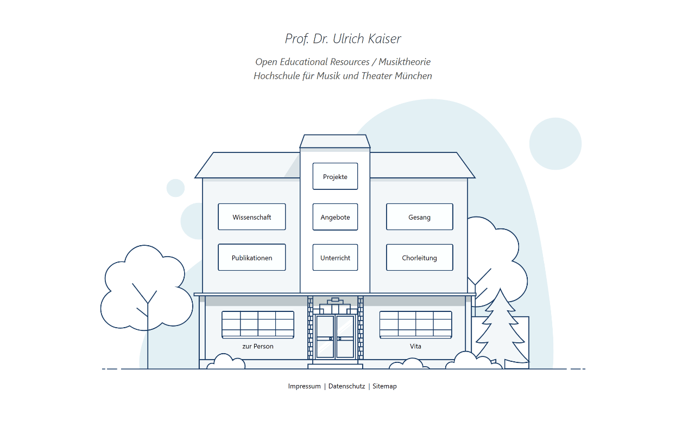

# kaiser-ulrich.de

Persönliche Homepage von Prof. Dr. Ulrich Kaiser (Musiktheorie, OER, Publikationen).



## Stack

- [Next.js](https://nextjs.org/) 16 (Static Export)
- [Chakra UI](https://chakra-ui.com/) v2
- CSS Modules
- Statische JSON-Dateien als Content-Layer

## Lokales Setup

```bash
npm install
npm run dev
```

Die Seite ist unter `http://localhost:3000` erreichbar.

## Build

```bash
npm run build
```

Der statische Export wird in `/out` generiert und kann direkt auf einem Webserver deployt werden.

## Hinweise

Mediendateien (Videos, Audio) sind **nicht** im Repository enthalten (`.gitignore`). Sie liegen direkt auf dem Webserver bzw. werden über externe CDN-Links eingebunden.

## Lizenzen

Dieses Projekt enthält Inhalte unter verschiedenen Lizenzen:

| Bereich | Lizenz |
|---|---|
| Code (Next.js, Komponenten, CSS) | [MIT](LICENSE) |
| Eigene Texte, Audiodateien und Medieninhalte von Ulrich Kaiser | [CC BY 4.0](https://creativecommons.org/licenses/by/4.0/) |
| Buch-Cover und Abbildungen aus Verlagspublikationen | Urheberrechtlich geschützt – alle Rechte bei den jeweiligen Rechteinhabern |

Wo eine abweichende Lizenz direkt am Inhalt angegeben ist, gilt diese vorrangig.
