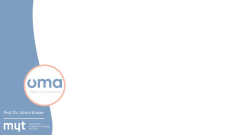
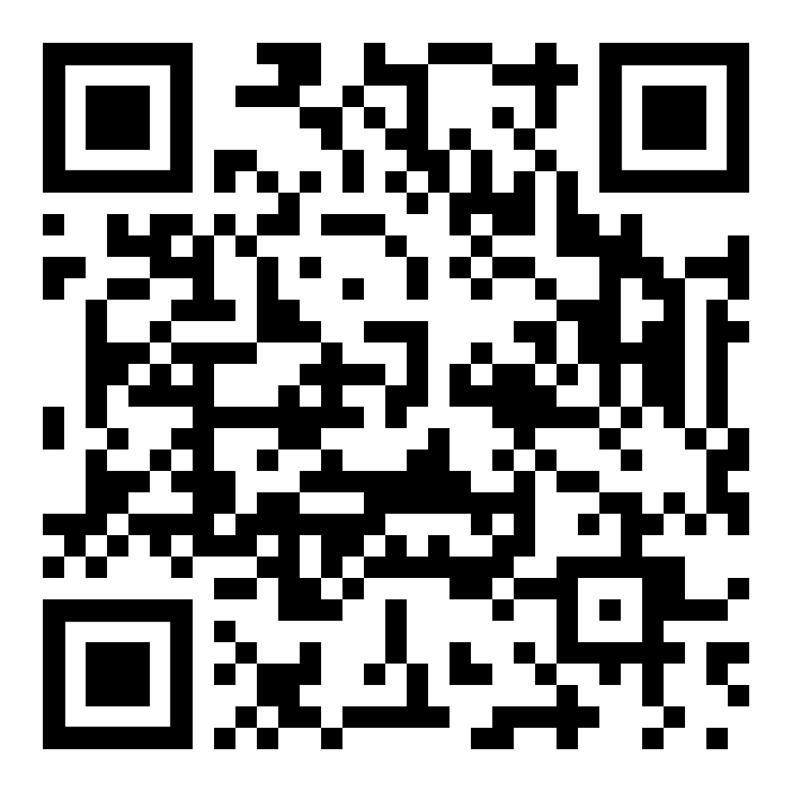
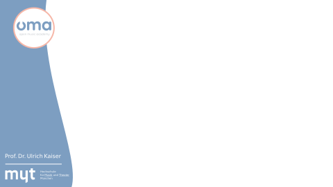
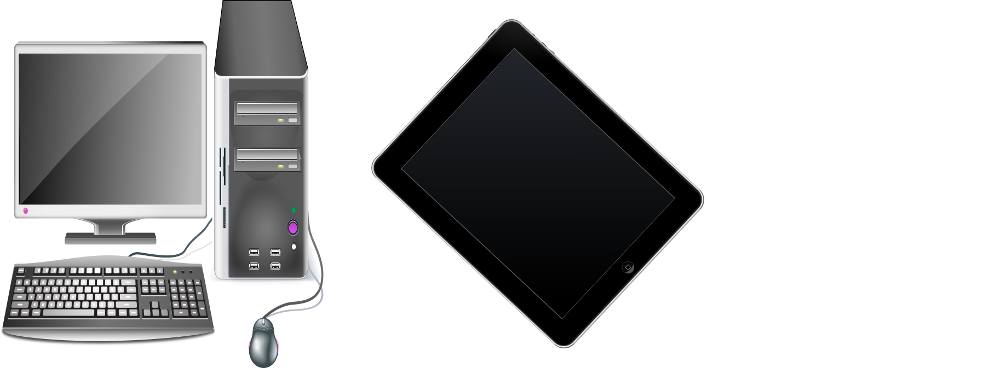
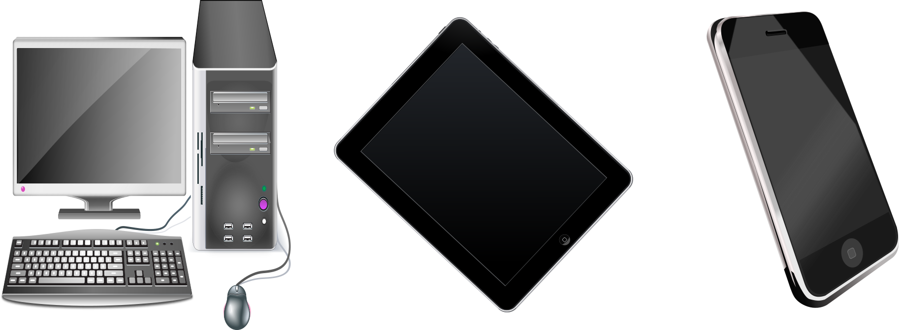
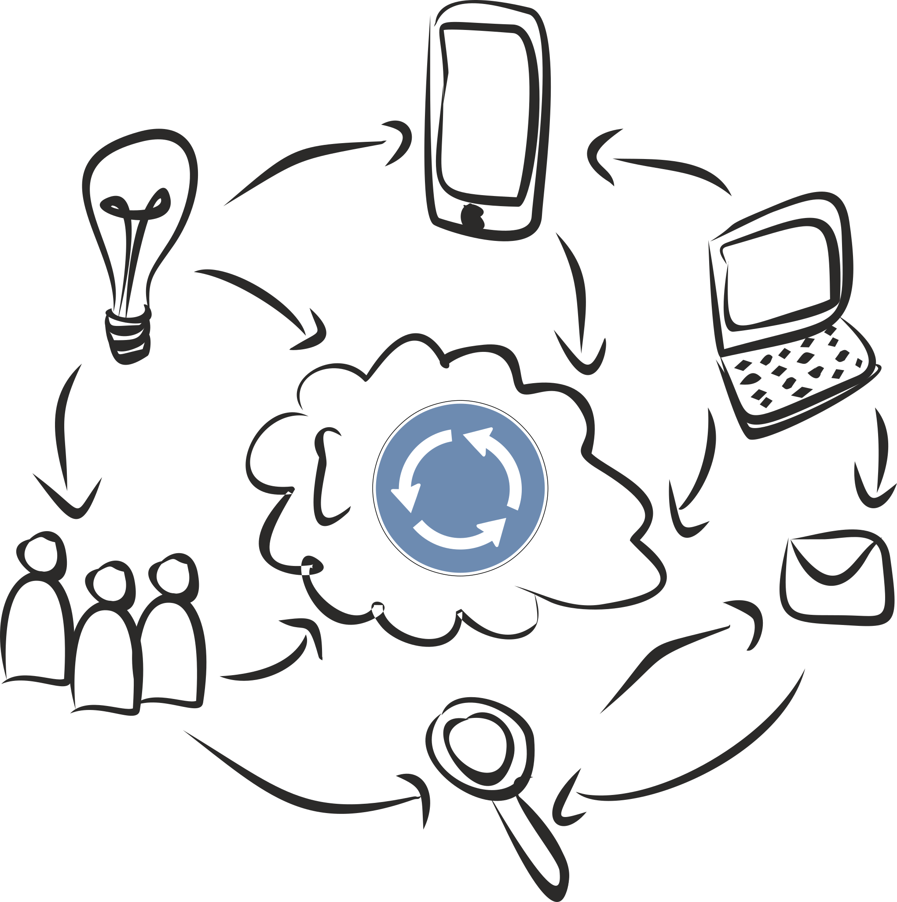
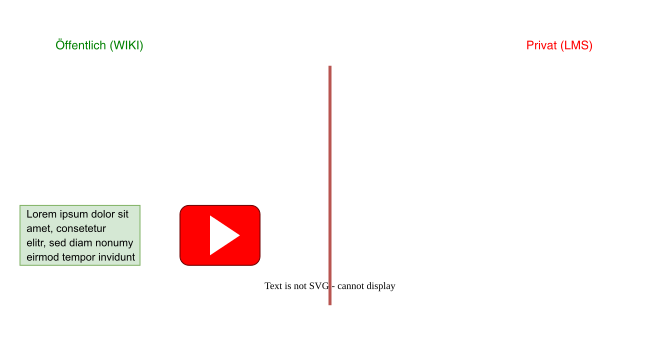
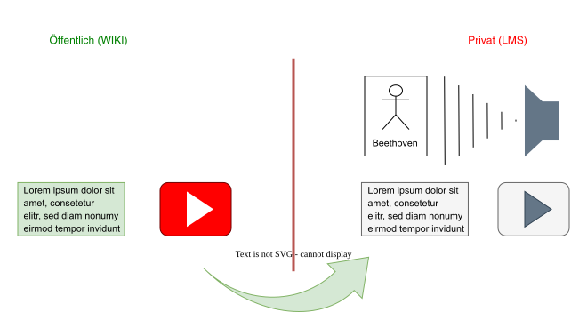
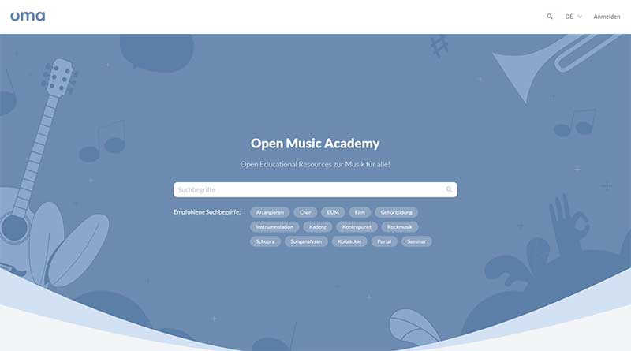

<link rel="stylesheet" href="layout.css">

  

  

  # Neue Medien im Klavierunterricht
  

  

  EPTA – European Piano Teachers Association\
  Tradition und Erneuerung in der Klavierpädagogik\
  vom 27. bis 28. Oktober 2023\
  Haus der Musik. Sing- und Musikschule Regensburg

  
  

---

## Ablauf

- Zur Person
- Neue Medien (mit großem *N*)
- Medienwechsel und die drei W-Fragen
- Freie Bildung, Urheberrecht & Nachhaltigkeit 
- Die [Open Music Academy](https://openmusic.academy/)
   

---

## Zur Person

* geboren 1963 in Berlin-Spandau
* Vater Kirchenmusiker, mit Kirchen- und Chormusik aufgewachsen
* ab dem 17. Lebensjahr ernsthafte Beschäftigung mit Musik
* abgebrochene Studiengänge: Schulmusik, Germanistik, Philosophie, Sport, Theologie und Religionswissenschaften
* abgeschlossene Studiengänge: Musiktheorie, Gehörbildung, Chorleitung, Operngesang und Prom. Musikwissenschaft
* 1992–1997: Arbeit an der HdK-Berlin (heute UdK)
* 1997–heute: Arbeit an der HMT München (Musiktheorie/Multimedia)
   

---

## Neue Medien (mit großem ***'N'***)
  
---

## Neue Medien (mit großem ***'N'***)

- Elektronische Geräte
  - Computer

---

## Neue Medien (mit großem ***'N'***)

- Elektronische Geräte
  - Computer
  - Tablets
   

---

## Neue Medien (mit großem ***'N'***)

- Elektronische Geräte
  - Computer
  - Tablets
  - Smartphones
   

---

## Neue Medien (mit großem ***'N'***)

- Elektronische Geräte
  - Computer
  - Tablets
  - Smartphones
- mit Vernetzungsmöglichkeit\
  über das Internet
   

---

## Medienwechsel

* DER SPIEGEL: *Wann Tablets im Unterricht schaden können* (37/2023)
* Das Medium verändert die Lesefähigkeit.
* Medienwechsel: Verlust und Gewinn
    
  * Klangvorstellung → Notenschrift
  * Notenschrift → Klangvorstellung → Wiedergabe
  * Flügel → Keyboard
  * Metronom → Playalongs
  * mdl. Hausaufgabe → Notizheft → Lern-Management-System (LMS)
   

---

## Drei W-Fragen

* **Was** verliere ich durch einen Medienwechsel?
* **Welche** Möglichkeiten gewinne ich durch einen Medienwechsel?
* **Warum** brauche ich den Medienwechsel? (Ziel)
   

---

## Freie Bildung, Urheberrecht & Nachhaltigkeit
  
  * Problem (Musik): **Freiheit & Urheberrecht**
  * Lösung: [Creative-Commons-Lizenzen](https://openmusic.academy/docs/4jf7wT5UMoqxMxtNaH46Mj/)
  * Offenheit → **Nachhaltigkeit** 
  * UNESCO: [Open Educational Resources (OER)](https://www.unesco.de/bildung/open-educational-resources)
  * Das Vorbild: Wikipedia
  * Meine Idee: ein Wiki zum Musiklernen & -lehren
   

---

## Die Open Music Academy (OMA)

---

  ## Die Open Music Academy (OMA)

  

---

  ## Die Open Music Academy (OMA)

  

---

  ## Die Open Music Academy (OMA)

  

---

## Materialien auf der OMA

---

  ## Achtung OMA!

  * Vorsicht beim Hochladen von Dateien:
    *  **Im öffentlichen Bereich ist nichts löschbar!**
    *  **private Dateien in Räumen → privater Speicherplatz erforderlich!** 
  * Kollaboratives Arbeiten verstehen:
    * **Keine ›Dropbox‹ für unveränderliche Dokumente**
    * **Keine Materialkiste, sondern sinnvolle Lerneinheiten**
  * Räume sind absolut ***privat*** (zum Ausprobieren, Verwerfen, Löschen, ...)
  * ***Der öffentliche Bereich vergisst nichts!***\
    (daher nur sinnvoll für ausgearbeitete Lernmaterialien)
  

---

  

  

  # Herzlichen Dank für die Aufmerksamkeit!

  

  

  EPTA – European Piano Teachers Association\
  Tradition und Erneuerung in der Klavierpädagogik\
  vom 27. bis 28. Oktober 2023\
  Haus der Musik. Sing- und Musikschule Regensburg

  

