<link rel="stylesheet" href="layout.css">

# Die Open Music Academy

Eine freie Lernplattform\
für Open Educational Ressources\
zum Lernen und Lehren im Bereich der Musik

Digitaler Treffpunkt\
Tonkünstlerverband Bayern e.V.\
Dienstag, den 23.04.2024, 19.00 Uhr – 21.00 Uhr (online)

---

## Ablauf

- Urheberrecht: Notwendig und problematisch
- Open Educational Resources (OER)
- Verständnisprobleme: Libre, Free und Open
- Nachhaltigkeit
- Die Open Music Academy (OMA)
- Die zwei Seiten der OMA (Stand: 2024)
- Ein OMA-Streifzug
- Diskussion

---

## Urheberrecht als Problem
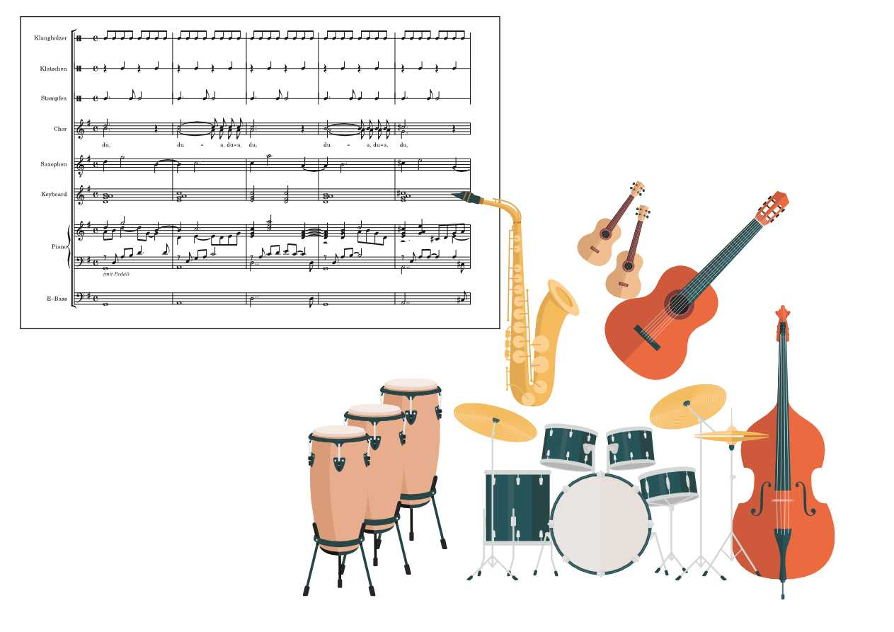

<a href="https://openmusic.academy/docs/q9RGjWnB5J3nV3rTHRpgif/bandklasse-mitspielsatz-that-image" style="display: block; margin: -200px 0 0 10px">Beispiel</a>

---

## Urheberrecht als Problem
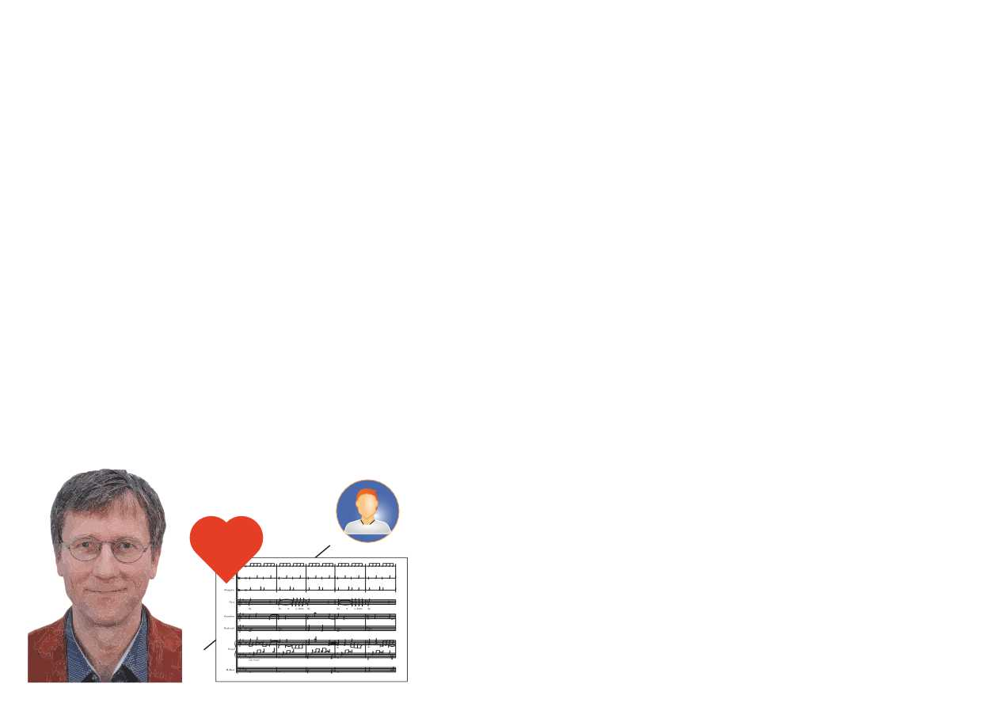

---

## Urheberrecht als Problem
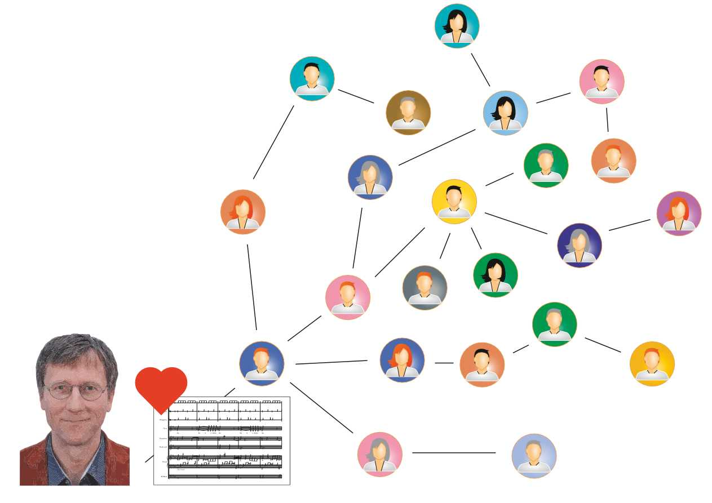

---

## Urheberrecht als Problem
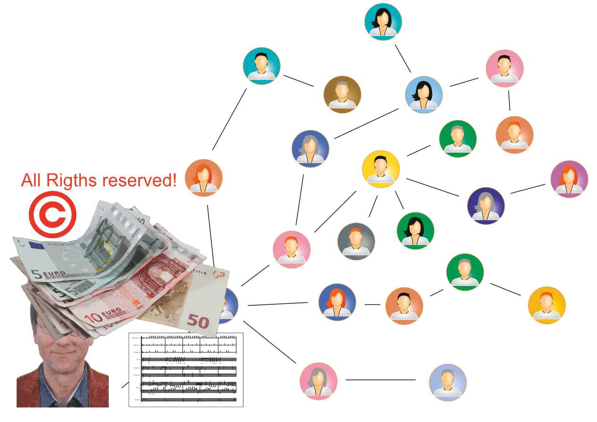

---

## Urheberrecht als Problem
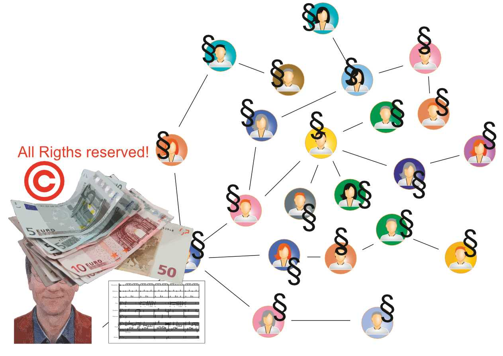

---

<!-- GNU: Richard Stallman -->
## Open Educational Resources (OER)

  ***Open Educational Resources (OER) sind jegliche Arten von Lehr-Lern-Materialien, die gemeinfrei oder mit einer freien Lizenz bereitgestellt werden.*** Das Wesen dieser offenen Materialien liegt darin, dass jedermann sie legal und kostenfrei vervielfältigen, verwenden, verändern und verbreiten kann. OER umfassen Lehrbücher, Lehrpläne, Lehrveranstaltungskonzepte, Skripte, Aufgaben, Tests, Projekte, Audio-, Video- und Animationsformate.

  Definition dt. UNESCO

---

## Was sind freie Lizenzen?

---

## Was sind freie Lizenzen?

Als freie Lizenzen werden Creative-Commons-Lizenzen bezeichnet:

* CC0
* CC BY
* CC BY-SA

---

## Was sind freie Lizenzen?

Als freie Lizenzen werden Creative-Commons-Lizenzen bezeichnet:

- CC0
- CC BY
- CC BY-SA

* CC NC (GEMA-NK-Lizenz)
* CC NC-SA
* CC NC-ND

---

## Was sind freie Lizenzen?
<a href="https://openmusic.academy/docs/4jf7wT5UMoqxMxtNaH46Mj/" target="_blank">
  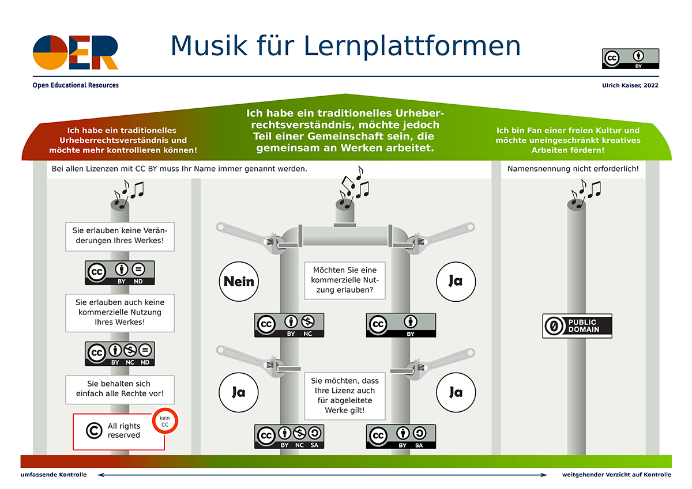
</a>

---

<!-- GWK = Gemeinsame Wissenschaftskonferenz von Bund und Ländern -->

## OER und Politik

- UNESCO (Weltkongresse zu OER 2012 in Paris und 2017 in Ljubljana)
* 2015 UNESCO Agenda 2030 für nachhaltige Entwicklung (Sustainable Development Goals 4: chancengerechte und hochwertige Bildung)
* OERCamps 2012 Bremen, seit 2016 OERinfo
* 2019 *UNESCO Recommendation on Open Educational Resources* unter Beteiligung des BMBF 
* 2021 GWK: Innovation in der Hochschullehre / Qualitätspakt Lehre
  * ab 2021: 150.000.000 EUR / Jahr\
  (über die *Stiftung Innovation in der Hochschullehre*)
* 2022 BMBF: OER-Strategie mit 6 Handlungsfeldern

---

## 6 Handlungsfelder

1) OER-Kompetenz pädagogischer Fachkräfte stärken
2) Von OER zu Open Educational Practices
3) Technische Strukturen für OER und OEP etablieren
4) Innovation und lernortübergreifende Bildung mit OER unterstützen
5) OER mit Forschung begleiten
6) Initiativen und Akteure zusammenführen

---

## Open Educational Resources (OER)

- UNESCO (2002 Open Courseware for Higher Education,   
  [Weltkongress zu OER 2012 in Paris](https://unesdoc.unesco.org/ark:/48223/pf0000246687_ger) und [2017 in Ljubljana](https://oasis.col.org/server/api/core/bitstreams/45bc3daf-d568-46a4-8c8a-53555b516daa/content))
- 2015 [UNESCO Agenda 2030](https://www.unesco.de/bildung/agenda-bildung-2030/bildung-und-die-sdgs) für nachhaltige Entwicklung (Sustainable Development Goals 4: chancengerechte und hochwertige Bildung)
- OERCamps seit [2012 Bremen](https://www.oercamp.de/), seit 2016 [OERinfo](https://open-educational-resources.de/)  
- 2019 [UNESCO Recommendation on Open Educational Resources](https://www.unesco.org/en/legal-affairs/recommendation-open-educational-resources-oer) unter Beteiligung des BMBF 
- 2021 GWK: Innovation in der Hochschullehre / Qualitätspakt Lehre
  - 150 Mio. EUR/Jahr ([Stiftung Innovation in der Hochschullehre](https://stiftung-hochschullehre.de/))
- 2022 BMBF: [OER-Strategie](https://www.bmbf.de/SharedDocs/Publikationen/de/bmbf/3/691288_OER-Strategie.pdf?__blob=publicationFile&v=6) mit 6 Handlungsfeldern
* 2023 BMBF [Förderung von Projekten zur Stärkung, Erweiterung und Vernetzung von OER-Communities](https://www.bundesanzeiger.de/pub/publication/N2zALx7zNrO4Ah3VOeb/content/N2zALx7zNrO4Ah3VOeb/BAnz%20AT%2008.05.2023%20B2.pdf?inline)

---

<!-- GNU: Richard Stallman -->
## Free? – Meinungsfreiheit (FSM) und Freibier

* MIT, Xerox und die emphatische Freiheit (1983 → GNU)  

---

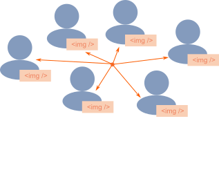

---

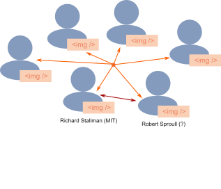

---

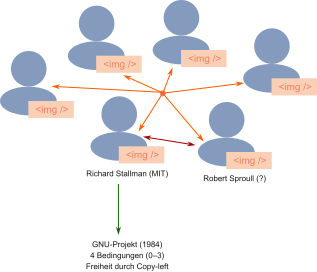

---

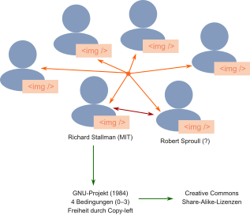

---

<!-- Mosaic: Eric Bina und Marc Andreessen -->
## Free? – Meinungsfreiheit (FSM) und Freibier

- MIT, Xerox und emphatische Freiheit (1983 → GNU)
* World Wide Web (1989 → Open Source)   

--- 

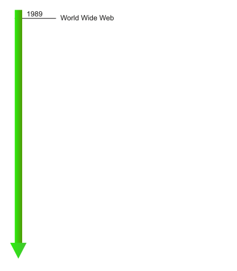

--- 

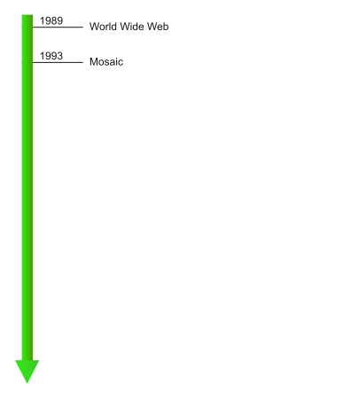

---

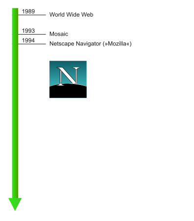

---

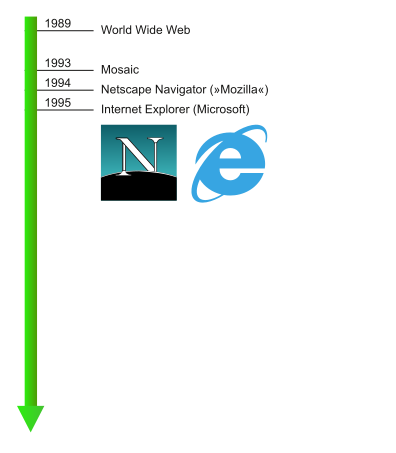

---

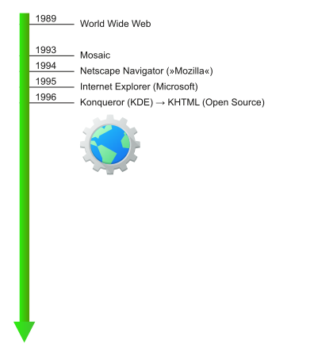

---

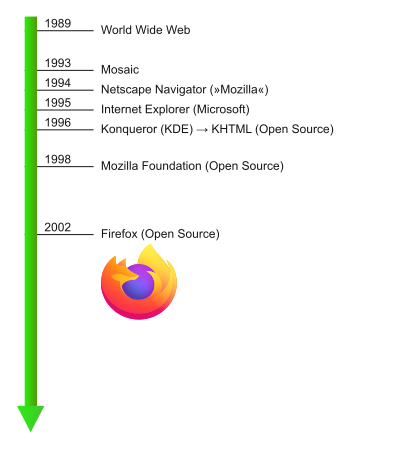

---

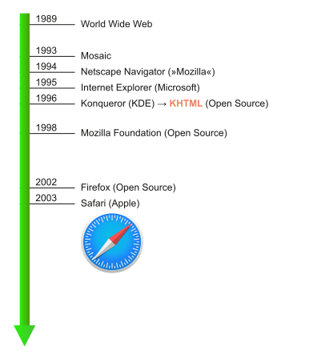

---

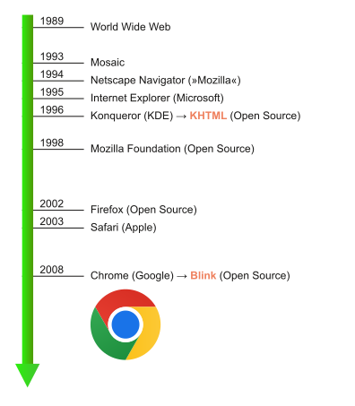

---

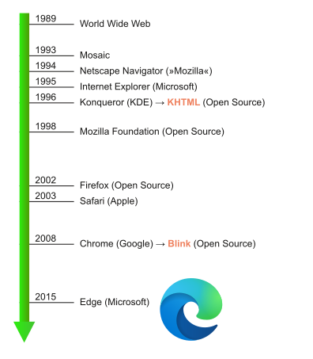

---

<!-- Mosaic: Eric Bina und Marc Andreessen -->
## Free? – Meinungsfreiheit (FSM) und Freibier

- MIT, Xerox und emphatische Freiheit (1983 → GNU)
- World Wide Web (1989 → Open Source)
* OER hat eine ***ethische*** und ***proprietäre*** Wurzel

---

## OER und Nachhaltigkeit

---

## OER und Nachhaltigkeit

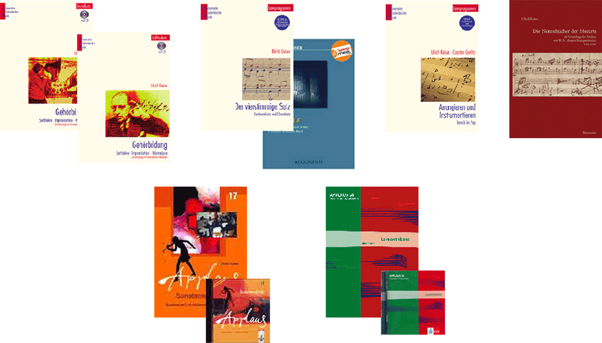

---

## OER und Nachhaltigkeit

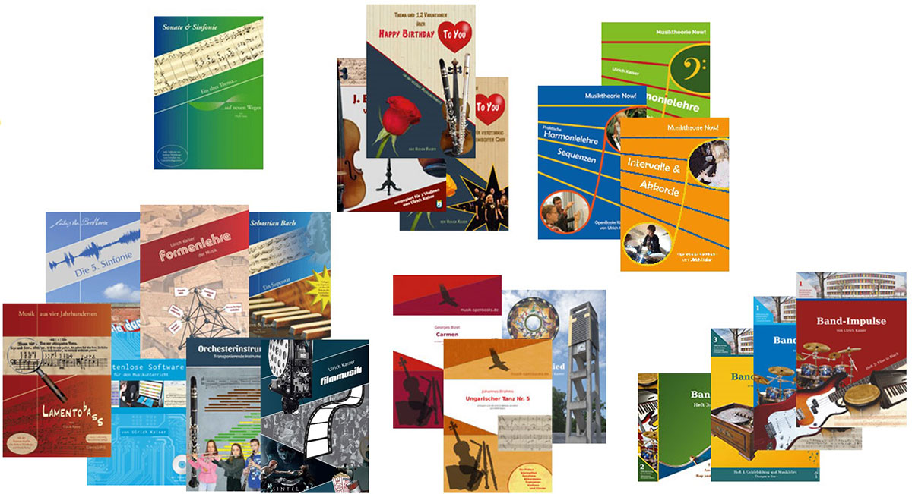

---

## OER und Nachhaltigkeit

  »Was mache ich eigentlich mit deinem ganzen Zeugs, wenn du mal tot bist?«     
  Regina Brauer-Kaiser, Regierungsdiraktorin a.D. und Ehefrau

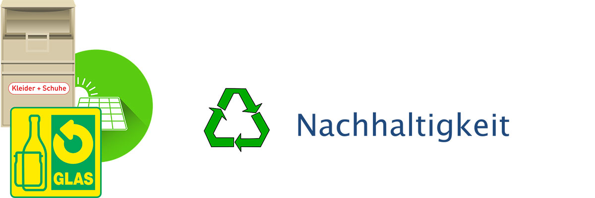
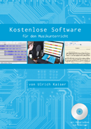

---

## Die Open Music Academy (OMA)

* Entwicklung eines Lernmanagment-Systems (LMS) unter freier Lizenz (MIT) mit speziellen Features zur Musik (→ [Open Music Academy](https://de.wikipedia.org/wiki/Open_Music_Academy))
* Übertragung und Skalieren meiner privaten OER-Aktivitäten
* Aufbau einer Community zum Thema *Musik und OER* (Musiklern-Wiki)
* Förderung der Idee durch die ***Stiftung Innovation in der Hochschullehre*** (Laufzeit 2021–2024, Volumen: 1,8 Mio. €)
* Einrichting Videostudio 12/2022 und OER-Erstellung
* Sonderförderung *Vernetzung* und *Sicherheit* (25.000 €)
* Fertigstellung Web-App 03/2023, Fixen von Bugs (12/2023)
* Projektverlängerung bin 12/2025   
  (Laufzeit 7/2024–12/2025, Volumen: 720.000 €)
* Vorhaben: *Integration* und *Evaluation*

---

  

  

  ## Die zwei Seiten der OMA (Stand: 04/2024)

  
  

  
---

  

  

  ## Die öffentliche Seite der OMA (Wiki)
  
  Aufgabe:
  
  Lesen Sie sich die folgenden Seiten zu [OMA-Idee](https://openmusic.academy/docs/UENw4dV1XcAEufGjp6czoz/die-oma-idee) durch und eantworten Sie sich anschließend die folgenden Fragen:

  - Gibt es Punkte, die Ihnen inhaltlich unklar sind?
  - Gibt es Punkte, die Ihnen inhaltlich unsympathisch sind?
  - Gibt es Punkte, die Sie für sich persönlich ablehnen würden?

  

---

## Die Innovations-Idee

---

  ## Die Innovations-Idee

  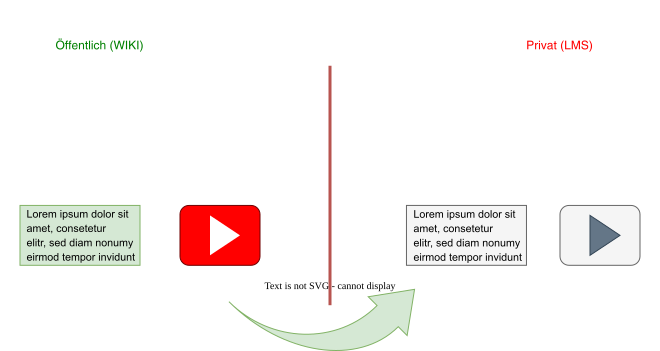

---

  ## Die Innovations-Idee

  

---

  ## Die Innovations-Idee

  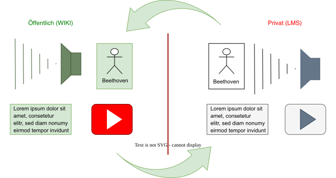

---

  ## Die private Seite der OMA

  * Konzipiert für modularen Unterricht
    (Kopieren von Plugins und Dokumenten)
  * Räume sind absolut privat und mit allen Dateien unwiderruflich löschbar   
    (individueller Unterricht, Sitzungen, Planungen, etc.)
  * Für private Dateien in Räumen ist ein privater Speicherplatz erforderlich!
  * Räume sind exklusiv oder kollaborativ
  * Räume haben eine History (mit Reverse-Funktion)
  * Asynchrone Kommunikation nur über externe Dienste und das iFrame-Plugin möglich (z.B. mit Google-Docs, Padlet etc.).

---

  ## Noch einmal: Die öffentliche Seite der OMA  
  * ***Im öffentlichen Bereich ist nichts löschbar!***\
  (History, Stable-Links, Versionsvergleich, Kommentarfunktion etc.)
  * **Keine ›Dropbox‹ für unveränderliche Dokumente**

---

  

  

  ### Suchen & Finden
  

  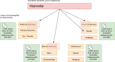

---

  

  

  ### Suchen & Finden
  

  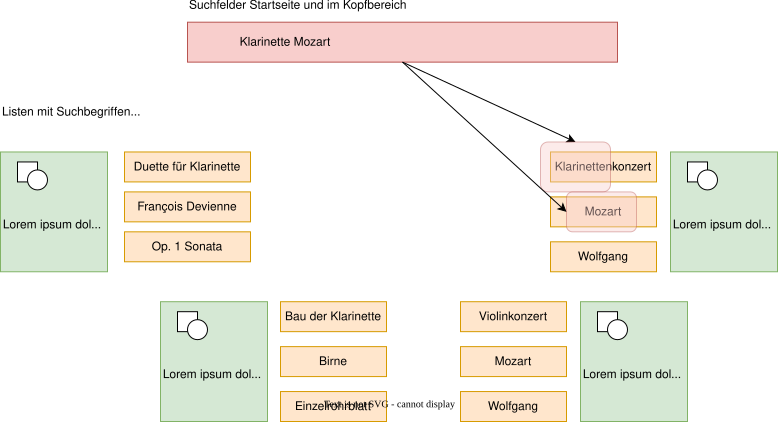

---

  

  

  ### Suchen & Finden
  

  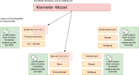
  
---

  

  

  ### Suchen & Finden

  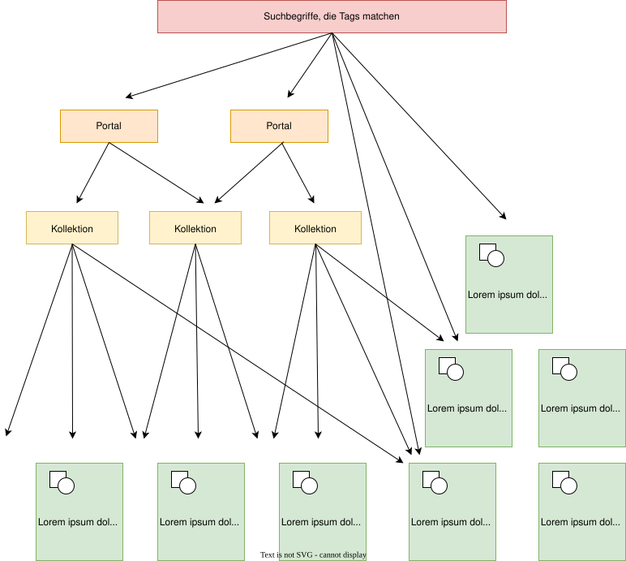
  

---

## Inside OMA

---

# Die Open Music Academy

Eine freie Lernplattform\
für Open Educational Ressources\
zum Lernen und Lehren im Bereich der Musik

Digitaler Treffpunkt\
Tonkünstlerverband Bayern e.V.\
Dienstag, den 23.04.2024, 19.00 Uhr – 21.00 Uhr (online)

